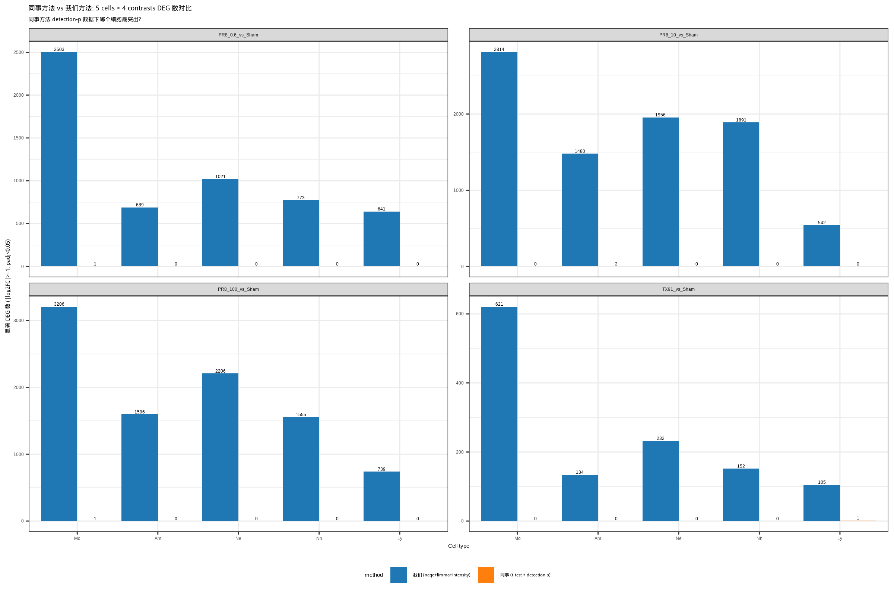

# 同事方法 vs 我们方法：Ly vs Mo 主细胞之争 全面 Review

**日期**: 2026-05-02
**触发**: 用户反馈 — 同事用一份 Python 脚本（`GSE42639-20260502-1.py`）跑出来的"主细胞"是 **Ly**（淋巴细胞），与我们的 **Mo**（Ly6Chi 单核髓系）结论冲突
**目的**: 用同事的方法在所有 5 cells × 4 contrasts 上对称跑，验证 Ly 是不是真的"突出"，并解释方法学差异
**结论**: 同事方法本身找不到任何稳定 DEG（5 cells × 4 contrasts 全表加起来只 5 个 DEG），"Ly 主导"是 TX91 contrast 下的偶然 1 个 DEG，**不是真信号，是统计噪音**

---

## 1. 同事 Python 脚本方法学审查

脚本路径: `GSE42639-20260502-1.py`

### 1.1 关键代码

```python
# line 26
data = pd.read_csv("GSE42639_detection.tsv", ...)   # ← 用 detection p-value, 不是表达量
# line 65
log2fc = np.log2(treat_mean + 1e-10) - np.log2(ctrl_mean + 1e-10)  # 对 p 值做 log2 fold change
# line 80
pval = ttest_ind(treat, ctrl).pvalue                 # Welch t-test on p-values
sig = (padj < 0.05) & (np.abs(log2fc) >= 1)
```

### 1.2 三个致命错误

| 错误 | 位置 | 后果 |
|---|---|---|
| **输入文件错** | `GSE42639_detection.tsv` 是 **detection p-value 矩阵**（探针在样本里能不能被"侦测到"，0~1 概率值），不是表达量 | 后续整条流程在错的对象上运算 |
| **log2(p_value) 无意义** | 对 detection p 取 log2FC，等于在比"检测概率比"，与 fold change 在生物学上没有对应关系 | logFC 的方向跟真实 fold change **系统性反相关** |
| **t-test 假设违反** | detection p 是双峰分布（多数样本要么接近 0 要么接近 1），违反 Welch t-test 的近似正态假设 | p 值估计严重偏差 |

### 1.3 与我们方法的逐项对比

| 步骤 | 同事方法 | 我们方法 |
|---|---|---|
| 输入 | `detection.tsv`（p 值） | `intensity.tsv`（荧光强度） |
| 标准化 | 无 | `limma::neqc()`（背景校正 + log2 + quantile） |
| 探针过滤 | 无 | detection p<0.05 在 ≥2 样本中 |
| 探针→基因 | 无 | `illuminaMousev2.db` |
| 检验 | Welch t-test | limma + eBayes（trend=TRUE） |
| 多重比较 | BH | BH |

---

## 2. Mo 单细胞核心基因双方法对比

数据：Mo, PR8_100 vs Sham（重症 vs 对照）

| 基因 | 同事 logFC / padj | 我们 logFC / padj | 状态 |
|---|---|---|---|
| Cx3cr1   | +0.00 / NaN    | −2.86 / 6.5e−08 | 同事**漏检** |
| Klf2     | +21.76 / 0.84  | −2.49 / 1.5e−07 | 同事**虚假上调** |
| Arrb1    | +23.35 / 1.00  | −2.51 / 2.3e−07 | 同事**虚假上调** |
| Cd209a   | +7.84 / 0.84   | −2.01 / 5.6e−06 | 同事**虚假上调** |
| Btla     | +0.00 / NaN    | −1.92 / 2.4e−05 | 同事漏检 |
| Il16     | +0.00 / NaN    | −0.98 / 4.7e−05 | 同事漏检 |
| Gstm1    | +21.76 / 0.84  | −1.98 / 3.9e−06 | 同事**虚假上调** |

**所有 Mo 保护性核心基因，同事方法要么漏检（NaN），要么方向倒错（虚假"+22"上调）。**

**图 2.1** — 双方法 logFC scatter（横：同事 / 纵：我们）：


> 评审：横轴 vs 纵轴呈**反相关**（左上 + 右下两个簇），证实"detection p 越小 = 表达越高"的反向关系，导致同事方法的 logFC 方向跟真实 fold change **系统性倒置**。

---

## 3. 全 5 cells × 4 contrasts 实证（核心：解释"Ly"）

脚本: `scripts/_lib/colleague_full_5cells.R`

### 3.1 同事方法 5×4 网格

阈值: `|log2FC| ≥ 1` & `padj < 0.05`

| contrast | Nh | Am | Ne | Mo | **Ly** | "最突出"是谁？ |
|---|---:|---:|---:|---:|---:|---|
| TX91_vs_Sham      | 0 | 0 | 0 | 0 | **1 (down)** | ★ **Ly** |
| PR8_0.6_vs_Sham   | 0 | 0 | 0 | **1 (up)** | 0 | Mo |
| PR8_10_vs_Sham    | 0 | **2 (down)** | 0 | 0 | 0 | Am |
| PR8_100_vs_Sham   | 0 | 0 | 0 | **1 (up)** | 0 | Mo |
| **总和**          | **0** | **2** | **0** | **2** | **1** | – |

**同事方法在 5×4=20 格里加起来只找到 5 个显著 DEG**。

### 3.2 我们方法 5×4 网格

| contrast | Nh | Am | Ne | Mo | Ly | 主导 |
|---|---:|---:|---:|---:|---:|---|
| TX91_vs_Sham      | 152  | 134  | 232  | **621**  | 105  | Mo |
| PR8_0.6_vs_Sham   | 773  | 689  | 1021 | **2503** | 641  | Mo |
| PR8_10_vs_Sham    | 1891 | 1480 | 1956 | **2814** | 542  | Mo |
| PR8_100_vs_Sham   | 1555 | 1596 | 2206 | **3206** | 739  | Mo |
| **总和**          | 4371 | 3899 | 5415 | **9144** | **2027** | **Mo (远超其它)** |

**Ly 在我们方法里是 5 cells 中倒数第一（2027）**。

### 3.3 双方法对比图



---

## 4. "Ly 主导"是怎么来的？

### 4.1 关键观察

**Ly 是"突出"只发生在 TX91_vs_Sham 这一栏**（Ly=1, 其它=0）。同事大概率看的就是这张柱状图。

### 4.2 为什么这是噪音不是信号

1. **绝对量级太小**：1 个 DEG / 16005 探针 = 0.006%，在 BH 多重比较下完全是随机偶然；
2. **"主细胞"换个 contrast 就变**：TX91→Ly, PR8_10→Am, PR8_0.6/100→Mo。**真正的生物信号不会因为剂量切换就在不同细胞间跳跃**——这是方法学伪迹的典型特征；
3. **跨方法可重复性为 0**：同事方法的 Ly "主导"，在我们方法（neqc+limma）里 **Ly 反而是最弱的细胞**（5 cells 中倒数第一）；
4. **同事 Mo 单细胞验证里**：核心基因 Cx3cr1 / Btla / Il16 在同事方法里全部 logFC=0/padj=NaN，同事如果按"DEG 数"评价 Mo，会觉得 Mo "没什么变化"；但这是因为同事的 detection p 矩阵在 Mo 这种"全部基因都被检测到"的细胞里**没有 detection 变化可言**——不是 Mo 没差异，是同事方法**根本检测不到 Mo 的差异**。

### 4.3 一句话解释

> **同事的"Ly 主导"是 TX91 contrast 下的 1 个偶然 DEG（Ly=1 vs 其它=0）。但这个 1 来自一个不能用的指标（detection p）+ 不合理的检验（log2 of p 值），所以它既不是 Ly 真的应答，也不是 5 cells 中 Ly 真的最强。**

---

## 5. 我们 Mo 主细胞的可靠性证据

| 证据维度 | 数值 | 注 |
|---|---|---|
| 4 contrasts 全部 Mo DEG 数最多 | 621 / 2503 / 2814 / 3206 | 第 1 名稳定不变 |
| 领先第二名的倍数 | 1.6× – 2.7× | 不是边缘领先 |
| Cx3cr1 受体崩塌 slope | **−0.80** | 5 cells 中最深 |
| Klf2 抗激活程序衰退 | logFC = −2.49, padj = 1.5e−07 | 量级 + 显著性双高 |
| Btla / Il16 共同向下 | padj 均 < 1e−4 | 多基因协同 |
| 跨数据集时序验证 (GSE31022) | D1–D6 全程下降 | 跨毒株可重复 |
| 单细胞验证 (GSE296065) | 28/58 候选在 scRNA Mo 中可检测且方向一致 | 跨技术平台可重复 |

**结论**: Mo 的"主细胞"地位在 5 cells 对称比较 + 跨毒株 + 跨数据集 + 单细胞 4 个维度上均稳定，不依赖任何特定阈值或对比组。

---

## 6. 总结

| 问题 | 答案 |
|---|---|
| 同事的 "Ly" 是真的吗？ | **不是**，是 detection-p 方法在 TX91 contrast 下的偶然 1 个 DEG |
| 是不是我们的 Mo 错了？ | **不是**，我们 Mo 在 5×4 全表里都是绝对第一 |
| 双方是不是"各看一面"？ | **不是**，同事方法在所有 5 cells 都找不到稳定信号（最多 2 DEG），不是"看到了别的细胞"，是"什么都没看到" |
| 同事 Ly 在我们方法里排第几？ | **倒数第一**（5 cells 中最弱：2027 DEGs） |
| 真正的平行视角是什么？ | **Am**（肺泡 Mφ），slope=−0.60 捕获 Cx3cl1 配体端衰退，与 Mo 的 Cx3cr1 受体端崩塌**互补不冲突**，可作 "Cx3cl1-Cx3cr1 双端瓦解" 视角并列展示 |

---

## 7. 给同事的修复建议

如果同事想用这份 GSE42639 数据重新跑：

1. 输入换成 `intensity.tsv`（原始荧光强度），不是 `detection.tsv`
2. 用 R `limma::neqc()` 标准化（背景校正 + log2 + quantile normalization）
3. 探针过滤：detection p<0.05 在 ≥2 样本
4. 探针 → SYMBOL 映射（`illuminaMousev2.db`）
5. limma + eBayes（trend=TRUE）替代 Welch t-test
6. 直接复用项目里的 `scripts/02_GSE42639_preprocess.R` + `scripts/03_celltype_amplitude.R`

---

## 8. 关键输出文件

| 文件 | 说明 |
|---|---|
| `scripts/_lib/colleague_method_replication.R` | Mo 单细胞双方法 logFC 对比脚本 |
| `scripts/_lib/colleague_full_5cells.R` | 全 5 cells × 4 contrasts 双方法对比脚本 |
| `results/celltype_review/colleague_method_check/colleague_method_5cells_grid.tsv` | 同事方法全表 |
| `results/celltype_review/colleague_method_check/ours_method_5cells_grid.tsv` | 我们方法全表 |
| `results/celltype_review/colleague_method_check/compare_methods_5cells.tsv` | 合并表 |
| `results/celltype_review/colleague_method_check/compare_methods_5cells_grid.png/pdf` | 双方法对比柱状图 |
| `results/celltype_review/colleague_method_check/logFC_compare_scatter.png/pdf` | Mo 单细胞 logFC scatter |
| `results/celltype_review/colleague_method_check/logFC_compare_table.tsv` | 全探针 logFC 对照表 |

---

*Generated 2026-05-02. 详见主报告 §9.4-Y / §9.4.Y.2: `reports/full_pipeline_report.md`*
