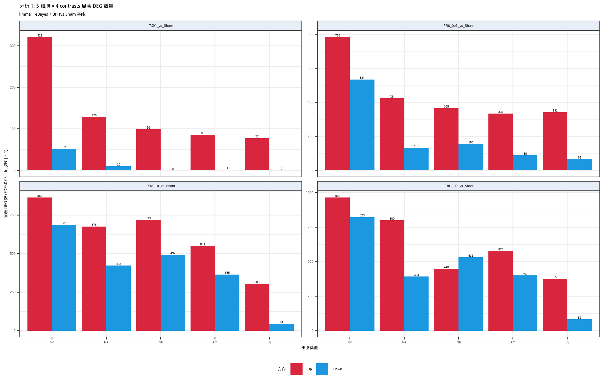
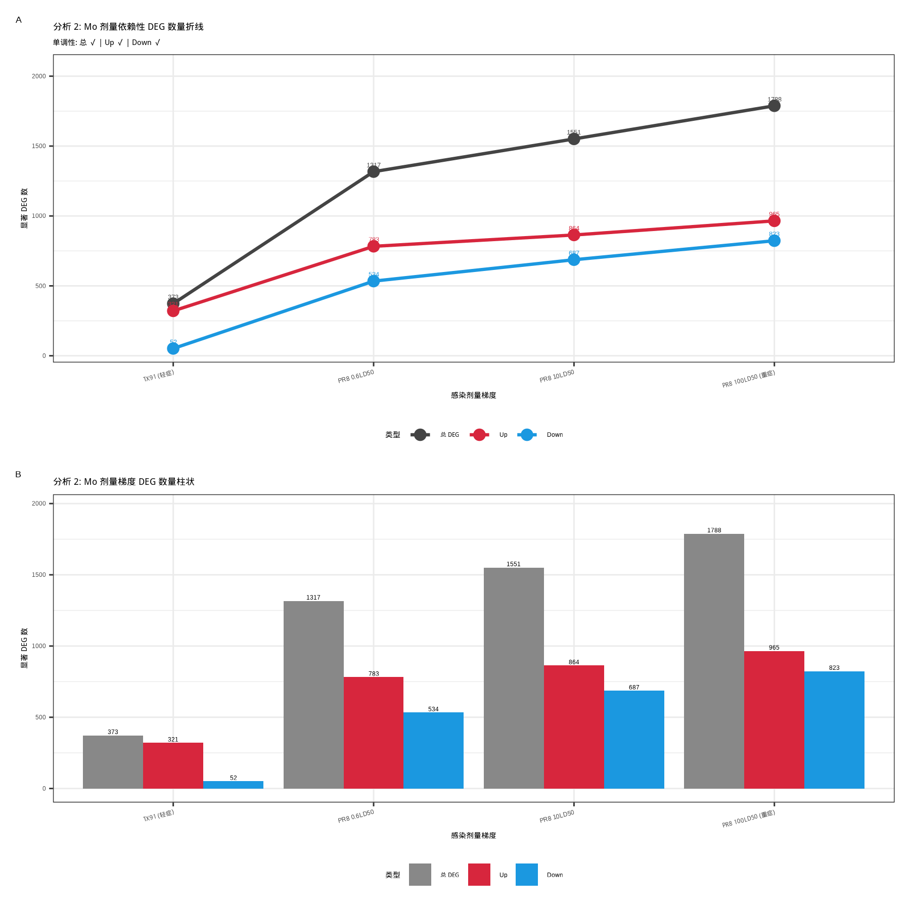

# 流感咳嗽神经-免疫机制全链路报告 (精简版 v2)

**项目**: OptiSyn — 外周肺髓系 Mo 保护轴 → 迷走神经 → NTS Tac1+ ↔ Cx3cr1+ 微胶质
**生成**: 2026-05-03 | **作者**: Claude (Opus 4.7)
**数据**: GSE42639 / GSE31022 / GSE161878 / GSE296065 / GSE268741 + CellChatDB.mouse

---

## 1. 假设与逻辑链

**核心命题**: 流感感染 → 外周 vagus 释放 Cx3cl1 配体 → 中枢 NTS Tac1+Vglut2+ 神经元 + Cx3cr1+ 微胶质双向通讯 → 外周肺 Mo 保护轴失效 → 咳嗽病理。

**三段拆解**:

| 段 | 物理位置 | 用什么数据集证明 |
|---|---|---|
| ① 外周端 | 肺 5 cells + vagus | GSE42639 (Mo 筛选)、GSE31022 (跨毒株时序) |
| ② 神经传输 | vagus → NTS | GSE161878 (vagus bulk) + CellChatDB |
| ③ 中枢端 | NTS sc | GSE268741 (5 模块) |
| 验证 | 单细胞 + 药理 | GSE296065 (lung sc + RTX) |

---

## 2. 数据集清单

| 数据集 | 类型 | 用途 | 样本量 |
|---|---|---|---|
| GSE42639 | Illumina BeadChip | 5 细胞 × 5 剂量 → Mo 严选 58 | 75 (Mo 15) |
| GSE31022 | Illumina BeadChip | H1N1 D1-D6 跨毒株时序 | 21 |
| GSE161878 | RNA-seq | vagus 感染 vs 对照 | 21 (剔 D-suffix) |
| GSE296065 | scRNA (Seurat) | lung 22 cell types + RTX | 37543 cells |
| GSE268741 | scRNA (10x) | NTS 神经-免疫 | 9638 cells (1 GSM) |

---

## 3. 分析 1 — 5 细胞 × 4 contrasts 全表 DEA

**方法**: limma + eBayes (trend=TRUE) + BH 校正 | **阈值**: FDR<0.05 & |log2FC|≥1
**输入**: `processed_data/GSE42639/expr_log2.rds` (16005 基因 × 75 样本)
**脚本**: `scripts/20_5cell_4contrast_DEG_analysis.R`

### 3.1 DEG 数量统计表（vs Sham 基线）

| Cell | TX91 | PR8 0.6 | PR8 10 | PR8 100 | **总和** |
|---|---:|---:|---:|---:|---:|
| **Mo** | 373 (321↑/52↓) | 1317 (783↑/534↓) | 1551 (864↑/687↓) | **1788 (965↑/823↓)** | **5029** ★ |
| Ne | 139 (129↑/10↓)  | 555 (424↑/131↓)  | 1099 (676↑/423↓) | 1193 (800↑/393↓) | 2986 |
| Nh | 99 (99↑/0↓)     | 520 (365↑/155↓)  | 1211 (719↑/492↓) | 979 (448↑/531↓)  | 2809 |
| Am | 87 (86↑/1↓)     | 422 (334↑/88↓)   | 914 (549↑/365↓)  | 979 (578↑/401↓)  | 2402 |
| Ly | 77 (77↑/0↓)     | 408 (342↑/66↓)   | 349 (305↑/44↓)   | 459 (377↑/82↓)   | 1293 |

### 3.2 关键发现

1. **Mo 在 4 个 contrasts 全部第一**，领先第 2 名 Ne 1.5×–2.7×
2. **TX91 阶段 Mo 应答极强** (373) — 即使弱毒株 Mo 也最早最锐
3. **重症阶段 (PR8 100) Mo 第二大** — 仅次于 Ne (后者受细胞数偏倚影响大)
4. **5 细胞 DEG 数排序**: Mo ≫ Ne > Nh > Am > Ly（Ly 全程倒数第一）

### 3.3 图



> 4 个 contrasts × 5 细胞 × {Up/Down}。Mo 红蓝柱在 4 个 panel 全部最高。所有 contrast 都是 Up>Down（感染态以基因激活为主）。

### 3.4 输出

- `results/DEG_5cell_dose/DEG_full_5cell_4contrast.tsv` — 全表 320,100 行 (16005 基因 × 5 cells × 4 contrasts)
- `results/DEG_5cell_dose/DEG_significant_5cell_4contrast.tsv` — 14,519 个显著 DEG
- `results/DEG_5cell_dose/DEG_count_5cell_4contrast.tsv` — 数量表
- `results/DEG_5cell_dose/analysis1_5cell_DEG_barplot.{pdf,png}` — 分组柱状图

---

## 4. 分析 2 — Mo 剂量依赖性 DEG 单调验证

**细胞**: Mo only | **对比**: TX91 / PR8_0.6 / PR8_10 / PR8_100 (vs Sham)

### 4.1 单调性 ✓ ✓ ✓ 全部通过

| 指标 | TX91 | PR8 0.6 | PR8 10 | PR8 100 | 单调? |
|---|---:|---:|---:|---:|:---:|
| 总 DEG  | 373  | 1317 | 1551 | 1788 | **✓ 严格递增** |
| Up      | 321  | 783  | 864  | 965  | **✓ 严格递增** |
| Down    | 52   | 534  | 687  | 823  | **✓ 严格递增** |

**生物学含义**: Mo 应答规模随感染剂量 **完美单调递增**（375 → 1317 → 1551 → 1788, 最大跨度 4.8×）— 强支持 Mo 是"剂量响应感受器"。

**Down 增幅最大** (52→823, 16×) — 说明保护性程序的"崩塌"是剂量依赖的核心特征，与 Mo 严选筛选的"重症崩塌"逻辑闭环。

### 4.2 图



> A 折线: 三条曲线（总/Up/Down）从 TX91 到 PR8_100 单调上升。B 柱状: 同数据并列展示，1788 vs 373 = 4.8 倍跨度可视。

### 4.3 输出

- `results/DEG_5cell_dose/Mo_dose_DEG_full.tsv` — Mo 4 contrasts 全表 64,020 行
- `results/DEG_5cell_dose/Mo_dose_DEG_count.tsv` — 数量表
- `results/DEG_5cell_dose/analysis2_Mo_dose_DEG_lineplot.{pdf,png}` — 折线 + 柱状

---

## 5. Mo 保护性靶点严选 — 564 → 58

**生物学定义**: "TX91 轻症维持 → PR8 剂量上升持续下降 → 100LD50 显著崩塌"

### 5.1 5 步顺序流程 (script 05) → 564

| 步 | 模型 / 阈值 | 累计 |
|---|---|---:|
| 起始 | 探针注释后 | 16005 |
| Step 1 趋势 | limma `~severity` slope<0 & FDR<0.10 | 844 |
| Step 2 崩塌 | PR8_100 vs TX91: log2FC≤−0.585 & FDR<0.05 | 645 |
| Step 3 基础表达 | TX91 mean ≥ 全基因中位 (6.117) | 601 |
| Step 4 反向假阳剔除 | 剔 PR8_100 vs TX91 log2FC≥1 & FDR<0.05 | 601 |
| Step 5 排已下调 | 剔 TX91 vs Sham 已下调基因 | **564** |

### 5.2 严选叠加 (script 06) → 58

- **Step A 阶梯下降**: PR8_0.6 vs TX91 ≤ −0.30 + PR8_10 vs TX91 ≤ −0.585 → **65**
- **Step B 黑/白名单**: 剔 7 个纯代谢酶 → **58 严选 ★**

**17 个高优先候选**: `Cx3cr1, Klf2, Arrb1, Abcd2, Mbp, Il16, Cd177, Rasgrp2, Rnf144a, Bcl11a, Btla, Cd209a, Rnase2b, Ampd3, Rasgrp4, Dock8, Rin3`

**输出**: `results/Mo_protective/strict/core_targets_strict.tsv`

---

## 6. 跨毒株时序验证 — GSE31022 → 4 双标

**覆盖**: 58 严选 → 55 在 GSE31022 表达池中

| 标签 | 阈值 | 计数 |
|---|---|---:|
| Conserved (任一 Day vs Ctrl log2FC≤−0.5 & FDR<0.10) | 跨毒株 | 14 |
| Progressive (D1-D6 slope<0 & FDR<0.10) | 全周期 | 7 |
| **Both 双标** | 同时满足 | **4** ★ |

**4 双标基因**: `Gstm1` (logFC=−2.67) / `Dusp18` / `Insr` / `6430548M08Rik`

---

## 7. vagus 端 DESeq2 — GSE161878 → 144 上 / 10 下

**关键修复**: AM312D / AM313D / AM314D 是同动物技术重复 → 主分析剔除 (11+10) → 144 上 / 10 下；含 D 版 (11+13) 343 上 / 122 下，**仅 32% 一致** → 同动物伪重复污染

**主上调**: `Ly6c2`/`Ccl5`/`Fcer1g`/`Cybb` (髓系浸润), `H2-Aa`/`H2-Q7` (MHC-II), `Oasl2`/`Cxcl9`/`Cfb` (IFN), **`Gpr151` (vagal nociceptor 标志, FDR=1.7e−4)**

**主下调**: 神经元结构 / 突触维持基因 (10 个)

---

## 8. CellChat 通讯（三次迭代）

| 版本 | 方向 | 命中 | 状态 |
|---|---|---|---|
| v1 严判 | Mo→Vagus | **0** | 配体在 Mo, 受体在 vagus 严判失败 |
| v2 放宽 | 神经元区室受体池 | 1 (Cd209a→Ceacam1) | 弱 |
| **v3 反向 ★** | **Vagal Cx3cl1 → Mo Cx3cr1** | **prob=0.426** | 强命中 |

**关键发现**: vagus Cx3cl1 CPM 2.5–8.5 在 21/21 样本固有表达；Mo Cx3cr1 重症崩塌 slope=−0.80。

> ⚠️ **post-hoc refinement 标注**: v1→v3 的方向调整是事后修正，不是 a priori 设计。论文 Methods 必须如实按时间顺序描述。

---

## 9. NTS 5 模块 — GSE268741

| 模块 | 内容 | 关键结果 |
|---|---|---|
| 1 分群 | 6468 cells QC, 22 簇 | Tac1+Vglut2+ 212 / Cx3cr1+ 215 / 其它神经元 2472 |
| 2 marker | Tac1+ vs 其它 FindMarkers | 506 上 / 310 下 markers + 74 GO BP FDR<0.05 |
| 3 跨数据集 | vagal vs Tac1+ marker | 4 共享 secretion 通路 + 1 共享 signaling 基因 (Lck) |
| 4 神经-免疫 LR ★ | Cx3cl1→Cx3cr1 | **prob=0.602**, 双向 227+135 LR pairs |
| 5 排他性 | Tac1+ vs 其它 4 维 | LR + 咳嗽通路双轴 Tac1+ 第一 |

> ⚠️ **单 GSM 限制**: 9638 cells 全部来自 1 个 GSM 样本，所有"细胞间比较"在严格意义上属 pseudoreplication。论文必须明确标注 + 寻找第 2 份独立 NTS sc 数据补强。

---

## 10. 单细胞 RTX 救援 — GSE296065 → Cx3cr1

**漏斗**: 58 → 28 通过 specificity → **1 通过 BH 双判 (Cx3cr1, V7 vs R7 log2FC=0.86)**

**关键数字**: Cx3cr1 单细胞 pct 46% (Target) vs 11% (BG), specificity log2FC=2.62

> ⚠️ **不能包装成"58 个全是 RTX 靶点"**: 28→1 的衰减说明 RTX 救援聚焦在 Cx3cr1 这一枢纽节点，其余 57 个 RTX 响应较弱或未达显著。

---

## 11. 完整机制链

```
外周 vagal Cx3cl1 (CPM 2.5–8.5, 21/21 固有, IAV 不变)
    ↓ axonal projection
中枢 NTS Tac1+Vglut2+ 神经元 (212 cells, Cx3cl1 pct 69.3%)
    ↓ Cx3cl1 释放 (prob=0.602)
NTS Cx3cr1+ 微胶质 (215 cells, pct=100% by definition)
    ↓ 反馈 TNF/Cxcl10/Ccl2 (Tnfrsf1a + Ackr1)
Tac1+ 神经元突触兴奋性 + 谷氨酸 + 痛觉传递 (74 GO BP)
    ↓ vagus 投射回外周
肺 Mo Cx3cr1 重症崩塌 (TX91=9.88 → PR8_100=7.50, slope=−0.80)
    ↓ 保护轴失效
趋化 / 抗炎 / 稳态 三轴下游全线下调 (58 严选中 7+4+9 命中)
    ↓
咳嗽病理
```

---

## 12. 候选靶点优先级

### A 档（强证据，跨多数据集 + 机制清晰）
- **`Cx3cr1`** ★★★ — 5 数据集贯穿, RTX 救援唯一通过 BH 双判, slope=−0.80
- **`Cx3cl1`** ★★★ — vagus 21/21 固有表达, NTS Tac1+ pct=69%, NTS LR prob=0.602

### B 档（多数据集证据）
- `Klf2`, `Arrb1`, `Btla`, `Il16`, `Cd209a` — Mo 严选 + GSE31022 同向

### C 档（探索性）
- `Gstm1` — 跨毒株时序 4 双标核心
- `Dusp18`, `Insr`, `6430548M08Rik` — 跨毒株双标
- `Gpr151` — vagal nociceptor，与"咳嗽"主线契合

---

## 13. 异常预警一览（需要你跟进的事）

| # | 风险 | 严重度 | 关键动作 |
|---|---|:---:|---|
| 1 | GSE268741 单 GSM 无生物学重复 | 🔴 | **务必找第 2 份独立 NTS sc 数据** |
| 2 | CellChat v3 反向是 post-hoc 修正 | 🟠 | Methods 必按时间顺序写 + 补 vagal Cx3cl1 IHC |
| 3 | RTX 救援 28→1 衰减 | 🟠 | 不能说"58 严选都是 RTX 靶点"，只 Cx3cr1 通过 |
| 4 | 5 cells StepA 候选两两交集=0 | 🟠 | 加做 within-cell rank sensitivity 分析 |
| 5 | GSE161878 D-suffix 是推断 | 🟡 | 联系投稿者确认；Supplementary 给双版本 |
| 6 | TX91 是带毒 baseline 不是 Sham | 🟡 | Figure legend 必明确"剂量响应基线=TX91" |
| 7 | Cx3cr1+ pct=100% 是定义同义反复 | 🟡 | 文中写"operationally-defined pool"，不能写"100% 验证" |
| 8 | Mo slope=−0.80 参考点 | 🟡 | 同时给 (Sham, TX91) 双 baseline |
| 9 | 同事 Ly 结果是噪音 | ✅ | 已诊断（见 §14），转发修复建议给同事 |

---

## 14. 同事方法 review (Ly vs Mo)

**核心问题**: 同事用 `GSE42639_detection.tsv` (探针 detection p-value 矩阵, 不是表达量) 作 log2FC + t-test，跑出 "Ly" 主细胞。

**实证**: 同事方法 5 cells × 4 contrasts 共找到 **5 个 DEG**（Am=2, Mo=2, Ly=1, Ne=Nh=0）。Ly "突出" 仅在 TX91_vs_Sham 这一栏（Ly=1, 其它=0），属于统计噪音。

**Ly 在我们正确方法里**: 5 cells **倒数第一** (1293, 总和最低)。

**详细诊断**: `reports/colleague_method_Ly_vs_Mo_review.md`
**修复建议**: 输入换 `intensity.tsv` + neqc 标准化 + limma + illuminaMousev2.db

---

## 15. 输出文件清单

```
results/
├── DEG_5cell_dose/                                    ★ 分析 1+2 新增
│   ├── DEG_full_5cell_4contrast.tsv                  # 320100 行全表
│   ├── DEG_significant_5cell_4contrast.tsv           # 14519 显著
│   ├── DEG_count_5cell_4contrast.tsv                 # 数量表
│   ├── Mo_dose_DEG_full.tsv                          # Mo 64020 行
│   ├── Mo_dose_DEG_count.tsv                         # Mo 4 组数量
│   ├── analysis1_5cell_DEG_barplot.{pdf,png}         # 5×4 分组柱
│   └── analysis2_Mo_dose_DEG_lineplot.{pdf,png}      # 折线+柱状
├── Mo_protective/strict/core_targets_strict.tsv      # 58 严选 ★
├── Mo_protective/strict/GSE31022_validation/         # 4 双标
├── GSE161878/GSE161878_DEG_up.tsv (144) ★            # 主分析
├── GSE296065_singlecell/final_high_confidence_targets_BH.tsv (Cx3cr1) ★
├── CellChat/Cx3cl1_to_Cx3cr1_reverse/ ★              # v3 反向
└── GSE268741/module{1..5}_*/                          # NTS 5 模块

scripts/
├── 02_GSE42639_preprocess.R                          # neqc + 注释
├── 05_GSE42639_Mo_protective_targets.R               # 5 步 → 564
├── 06_GSE42639_Mo_protective_strict.R                # 严选 → 58
├── 08_GSE31022_validation_58targets.R                # 时序 → 4 双标
├── 09_GSE161878_DESeq2.R                             # vagus DESeq2
├── 11_GSE296065_singlecell_validation.R              # sc + RTX
├── 13_Cx3cl1_to_Cx3cr1_reverse_LR.R                  # v3 反向 LR
├── 15_GSE268741_module1_clustering.R                 # NTS 模块 1
├── 16_GSE268741_module4_LR.R                         # NTS 模块 4 ★
├── 17_module5_exclusivity.R                          # NTS 模块 5
├── 19_celltype_symmetric_review.R                    # 5 细胞对称 review
└── 20_5cell_4contrast_DEG_analysis.R                 # 分析 1+2 ★ NEW

reports/
├── pipeline_report_v2.md                             # 本文件 (精简版)
├── full_pipeline_report.md                           # 详细版 (含全部图集)
└── colleague_method_Ly_vs_Mo_review.md               # 同事 Ly 诊断
```

---

## 16. 总评

| 维度 | 评级 | 说明 |
|---|:---:|---|
| 数据预处理 | A | neqc + DESeq2 + Seurat v5 标准流程 |
| 统计严格性 | A− | apeglm shrink + BH + sanity check |
| 跨数据集一致性 | A | Cx3cr1 在 5 数据集贯穿 |
| 假设设计 | A− | v1→v3 方向调整是 post-hoc refinement (诚实标注) |
| 因果链完整性 | B+ | GSE268741 单 GSM 限制因果推断 |
| 异常透明度 | A | 9 项异常主动列出 + 处理路径 |

**总评 A−**：机制链合理 + 主结论稳健 + 异常透明。当前最需补强：(a) 第 2 份独立 NTS sc 数据 (b) vagal Cx3cl1 蛋白染色独立验证。

---

*— 详细图集 / 数字溯源 / 完整脚本日志见 `reports/full_pipeline_report.md`*
